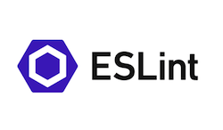

# Past, Present, and Future
If someone told me that I would end up majoring in Computer Science I would have thought that they were crazy. I never thought that I would be able to have the skill level to even think about doing something with computers. After going through several different majors I realized everything I wanted to do before was not my interest now. So, I took the beginning class of computer science and I enjoyed it. As I got higher in the classes the more it kept challenging my abilities. I then took ICS 314 and this class gave me so many tools to succeed in my future classes. 

# Coding Standards
I know we have all experienced peer reviewing someone's paper and they have a lot of grammar mistakes. They are switching the different "theirs", has run on sentences, and some sentences just don't make any sense. It makes you wonder if they took the error marks on word as a suggestion. 

From elementary school till now we are constantly being reminded of proper grammar. Now with different software it is easier to catch your mistakes. In the computer world there is something similar to grammar, that is coding standards. Something to help us along this coding standard journey is ESLint. ESLint is a analysis tool that is used to identify problematic patters found in JavaScript code. By having ESLint run in the background of IntelliJ I was able to quickly notice if I had something wrong with my structure or coding grammar. A red light bulb and red line would appear where you have an error. Using ESLint has made my coding experience so much easier because I am able to quickly catch my mistakes. 

# Agile Project Management  
When it comes to working on projects it is always important to stay organized. Agile Project Management is an approach that helps immensely with organization. It allows a team project to be broken down into a sequence of milestones. Within the different milestones there are issues that are assigned to different members. Once an issue has been completed it will be marked as closed in Github and moved to another column. I was first introduced to this organization system when working with my group on [Manoa Eats](https://manoa-eats.xyz/#/). With this approach it gave me a clear picture of the different tasks that we wanted to complete during the different milestones. Agile Project Management can be used in all projects because it is so important to make sure everything is laid out clearly so there is no miscommunication. 
