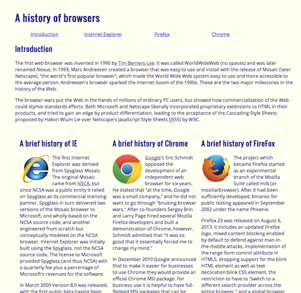
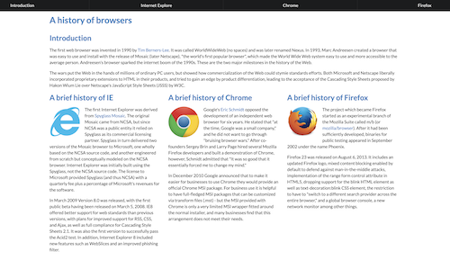

  
## Trying Something New
Back in middle school when we needed to design webpages for homework we would only be using Weebly or the pre-made templates that are free. When using the pre-made templates you are very limited with what you are able to do and how it will look. However, I still wanted mine to stand out among everyone else's, I just never knew how big companies did that. Then I took ICS 314 - Software Engineering and we first learned how to make basic webpages using HTML. Once we got the hang of that we were then introduced to an amazing tool called Semantic UI. It brings so much light and broadens your horizons with the look of your end product and what you are able to create.

## Making Things Pretty!

When we first created the RAW webpage I was impressed at how we could create something like that purely from our code. Where you are able to create responsive links, change the background color and layout. I was amazed that I was able to create it. Then we were introduced to Semantic UI and it completely changed my perspective on webpages. The two webpages shown above are complete opposites. When using Semantic UI it gives an overall cleaner and professional look. 

## Take Away
After being introduced to Semantic UI I am not able to go back to just using HTML and CSS code. It looks less professional and there are so many more steps involved in creating a functioning page. I feel everyone that is interested in computers should at the very least get introduced to Semantic UI. It will make life so much easier. 