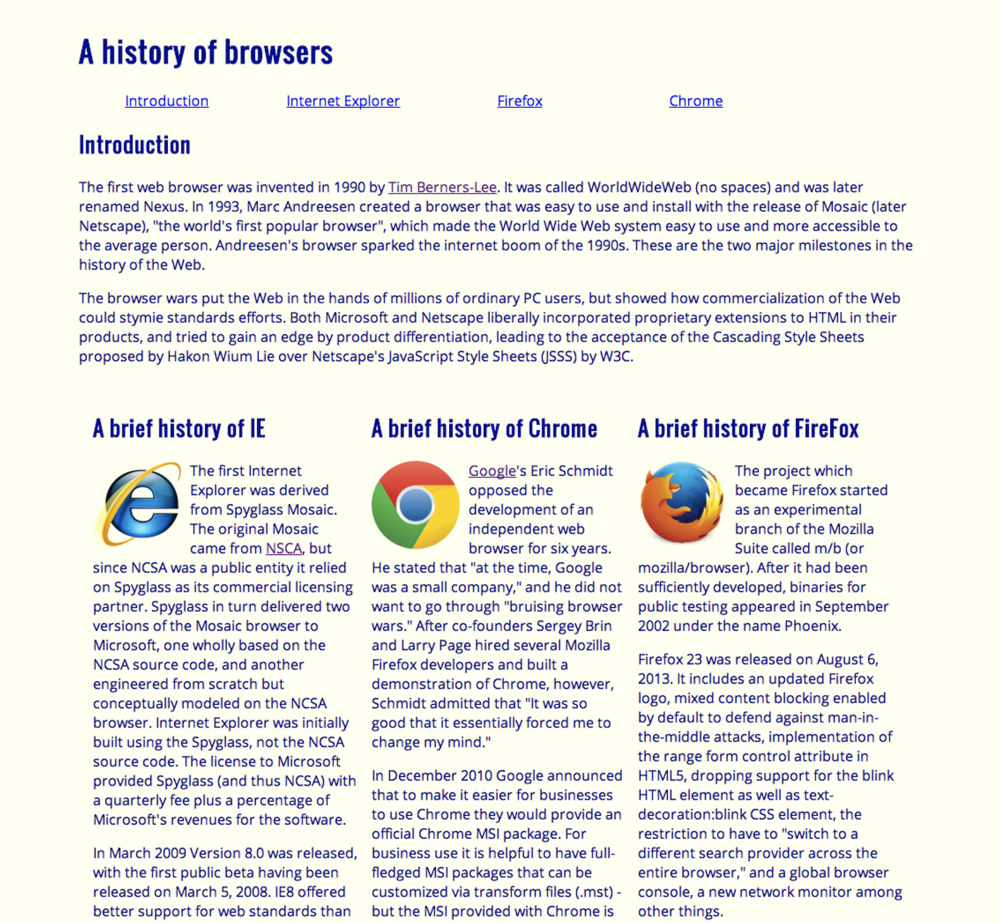
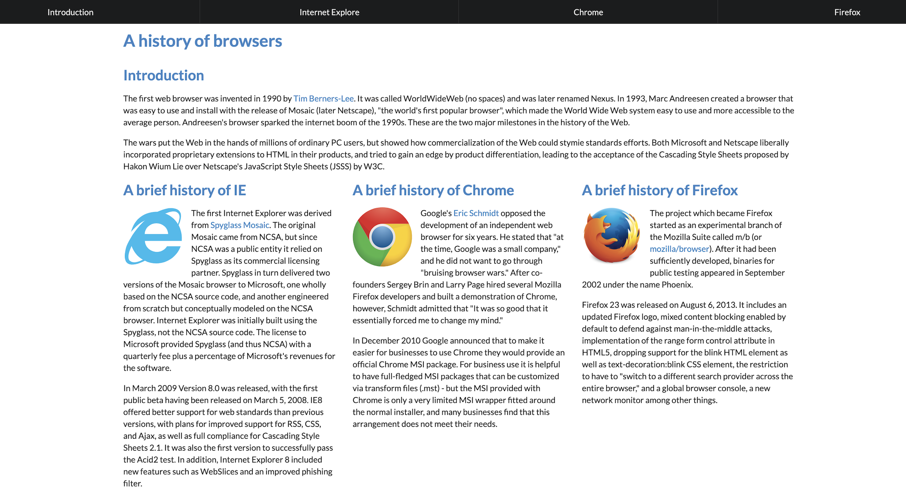

  
## Trying Something New
Before taking Software Engineering I always wondered how companies would create their websites. It never occurred to me that they would code every aspect of their finished product. 

## Making Things Pretty 

When we first created the RAW webpage I was impressed at how we could create something like that purely from our code. Then we were introduced to Semantic UI and it completely changed my perspective on webpages. 