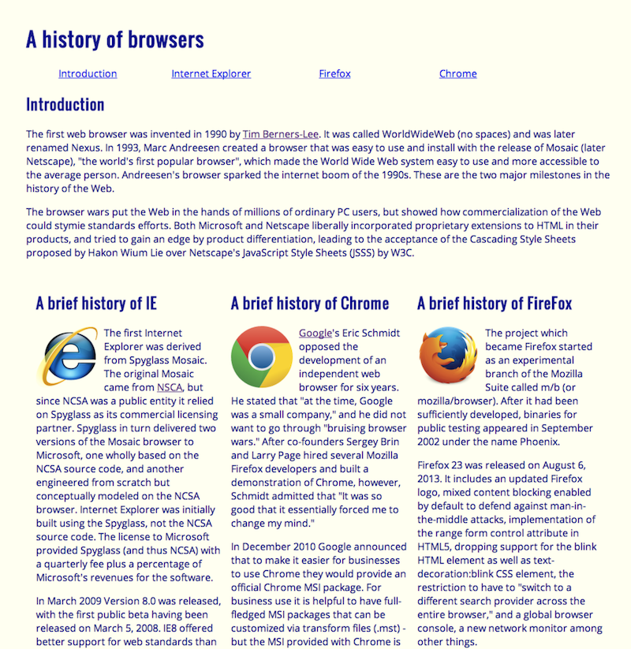

  
## Trying Something New
Before taking Software Engineering I always wondered how companies would create their websites. It never occurred to me that they would code every aspect of their finished product. 

## Making Things Pretty

When we first created the RAW webpage I was impressed at how we could create something like that purely from our code. Where you are able to create responsive links, change the background color and layout. I was amazed that I was able to create it. Then we were introduced to Semantic UI and it completely changed my perspective on webpages. The two webpages shown above are complete opposites. When using Semantic UI it gives an overall cleaner and professional look. 

## Take Away
After being introduced to Semantic UI I am not able to go back to just using HTML and CSS code. It looks less professional and there are so many more steps involved in creating a functioning page. 