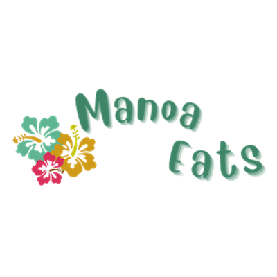
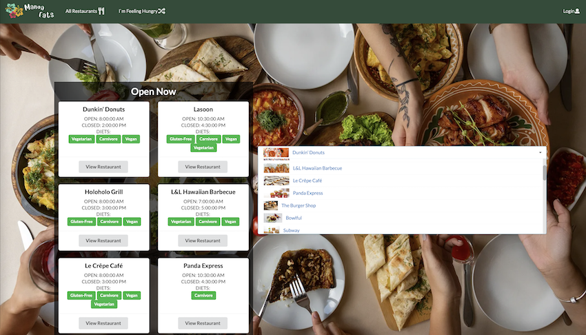

# Overview
Do you ever find yourself always eating at the same places and always wanting to try something new? Well you are not alone, not many students know about all of our fine dish eateries on the UH Manoa campus. In addition, some students who want to try new restaurants may not get a chance to because they may have time conflicts with their schedule leaving some restaurants having either too many students in line or not enough students.

Not to worry, [Manoa Eats](https://manoa-eats.xyz/#/) is here to help! 

Manoa Eats is a web application that will allow students and staff access to different eateries in and around campus. Manoa Eats will allow hardworking students to nourish their brain's with UH's nutritious foods. 

When you first visit our web application you will be greeted by our landing page which will show you which restaurants are currently open.

# Contributions 
Throughout this project I was in charge of working on and updating our [Github.io](https://manoa-eats.github.io) page. 
Other tasks I was also in charge of were: 

- Creating some of our initial page mockups
- Creating users and user profiles 
- Creating a cleaner look for our web application
- Adding in menu data 

# Take Aways
This was my first big project working with a team. It is difficult working with a lot of different personalities and work ethics. I feel our biggest challenge we needed to over come was figuring out a time we were all free. We were having small meetings on the weekends through discord to go over our weekly tasks and we would be meeting before class to code our application. Thankfully Discord was invented, it made it a lot easier to have messaging and video calls all in one place. It is also so important to always communicate and plan with everyone so two people are not working on the same task. Or there are certain implementations that are unable to happen unless someone finishes their part. Using the projects tab in Github helped tremendously because we were able to see the set of tasks that needed to be finished and once a task was completed it would no longer be open.

# We're Here to Help!
Manoa Eats is designed, implemented, and maintained by
[Tyler Baguio](https://tylerb8.github.io), [Kristi Chinen](https://kristihchinen.github.io), [Jeraldine Milla](https://itsjerie.github.io), [Nenye Ndili](https://nenyehub.github.io), [Gavin Peng](https://devgav.github.io)

_Check out our [source code](https://github.com/manoa-eats/manoa-eats)_

